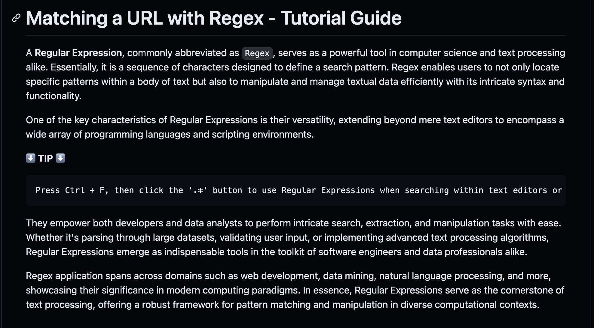
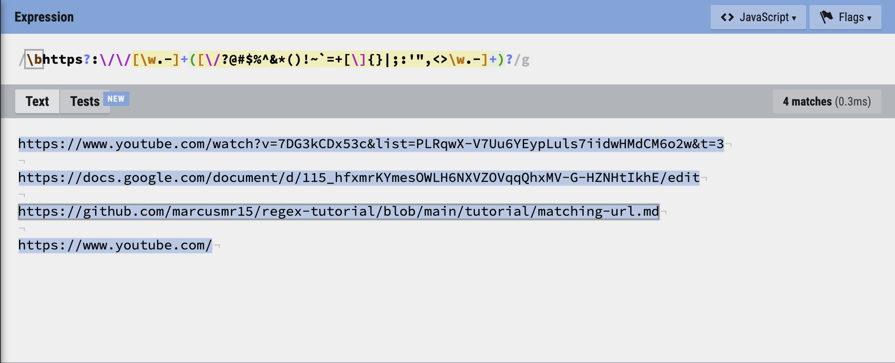
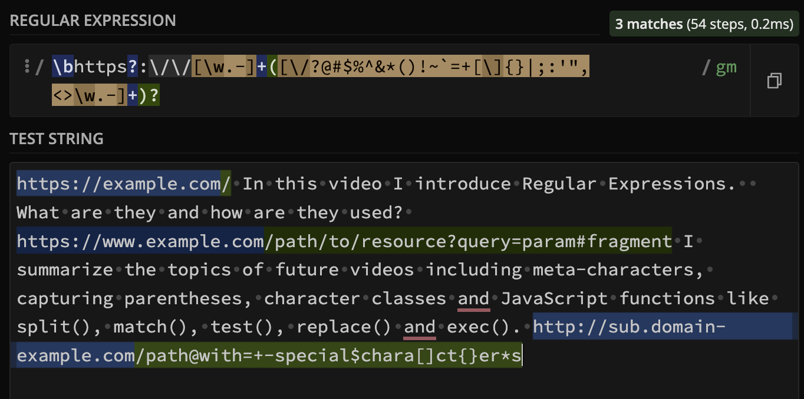

# Regex Tutorial

## Description

The purpose of this project is to learn how to use Regular Expressions `Regex` for pattern matching, text manipulation, and data validation. This tutorial will guide you through the basics of Regex, explaining its components and syntax with a practical application. In this case, we will be analyzing a Regex that matches URLs of any kind, length, and pathing.

Here is what the Regex with these characteristics looks like:

~~~
\bhttps?:\/\/[\w.-]+([\/?@#$%^&*()!~`=+[\]{}|;:'",<>\w.-]+)?
~~~

Please click the following link to refer to the tutorial ➡️ [Matching a URL with Regex - Tutorial Guide](https://gist.github.com/marcusmr15/26c3e0fadd0998dcc3fcd6bc30bbdd71)  🗒️

## Table of Contents

* [Installation](#installation)
* [Usage](#usage)
* [Credits](#credits)
* [License](#license)

## Installation

No installation needed. Simply click either the link provided in the `Description` or [here!](https://gist.github.com/marcusmr15/26c3e0fadd0998dcc3fcd6bc30bbdd71)

## Usage

This tutorial is intended for anyone interested in learning about Regex, whether you're a beginner or looking to refresh your knowledge. Follow the steps in the tutorial to understand how to construct and use Regular Expressions in various scenarios.

Example Uses of Regex:

- Text Search: Find patterns within large text files.
- Data Validation: Ensure user input follows specified formats (e.g., email addresses, phone numbers).
- Web Scraping: Extract information from web pages.
- String Manipulation: Modify text by identifying and replacing patterns.

## Credits

This project was made possible with the help of:
1. The `Chat GPT` AI developed by __Open AI__.
2.  The `Xpert Learning Assistant` AI developed by __edX__.
3.  The [Regexr](https://regexr.com/) and [Regex101](https://regex101.com/) websites for Regex testing.

4. The [Session 2: Regular Expressions - Programming with Text](https://youtube.com/playlist?list=PLRqwX-V7Uu6YEypLuls7iidwHMdCM6o2w&si=kYcoWgtGTHhSn008) video playlist tutorials by [The Coding Train](https://www.youtube.com/@TheCodingTrain) on YouTube.

This tutorial and README was created by [Marcos Munoz](https://github.com/marcusmr15).

## License

N/A.
